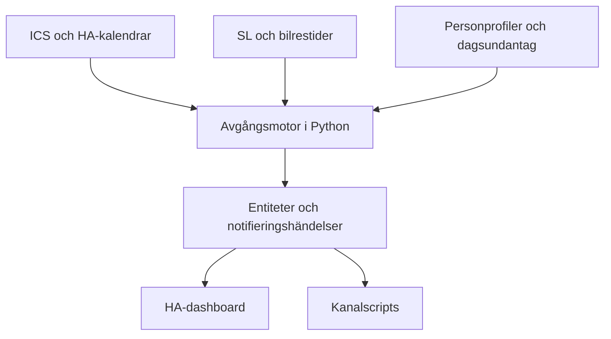

# Familjens avgångsplanerare – implementationsspecifikation

Version 1.1 · 2026-09-30 · Målplattform: Home Assistant Green med HA OS

## 1. Mål och beslut

Bygg en egen Home Assistant-integration i Python, domän `family_departures`, som beräknar när varje familjemedlem bör lämna hemmet för att hinna till dagens första lektion eller arbete. Integrationen ska välja och bevaka konkreta SL-resor, läsa trafikbaserad bilrestid och använda förkonfigurerad statisk restid (cykel/gång). HA sköter gränssnitt, närvaro och meddelandekanaler.

Dokumentet är ett byggunderlag för en kodagent/utvecklare. Det är en specifikation, inte en redan installerad eller testad integration. Egna tjänster, entiteter och händelser nedan ska implementeras; de finns inte i HA i dag. Kodexempel är kontraktsillustrationer om inte annat anges.

Hushållet modelleras som en generisk uppsättning användardefinierade profiler. Namnen nedan är anonymiserade persona-etiketter (två barn, två vuxna); en verklig installation skapar sina egna profiler i UI.

| Person | Schema | Destination i v1 | Färdsätt |
| --- | --- | --- | --- |
| Barn A | Vklass, personlig ICS-prenumeration | Fast skola | Konfigureras i UI |
| Barn B | SchoolSoft, ICS-flöde för vårdnadshavare (verifierat 2026-09-30) | Fast skola (annan än Barn A:s) | Konfigureras i UI |
| Vuxen A | Manuellt i HA; flextid, kalenderstart = senaste ankomsttid | Fast arbetsplats | Konfigureras i UI |
| Vuxen B | Manuellt i HA; fast återkommande schema | Fast arbetsplats | Konfigureras i UI |

Beslut från användaren: Python, första lektionen, fasta destinationer, standardfärdsätt med dagsundantag, externa trafik-API:er tillåtna, förkonfigurerad cykeltid, både rekommenderad och senaste avgång. Companion App och `person.*` ska införas som del av installationen. Stöd ska finnas för push, Live Update, dashboard, TTS och familjechatt. Familjeschema och närvarologik hålls lokalt.

Fastställda förutsättningar (2026-09-30):

- Alla fyra har Android-telefoner och godkänner platsspårning via Companion. iOS stöds inte i v1.
- Alla destinationer ligger inom SL:s område. ResRobot och andra operatörer behövs inte.
- Barnen går i olika skolor, reser var för sig och skjutsas aldrig. Planer är oberoende per person.
- Första lektionen på annan plats än skolan är sällsynt. V1 har inget destinationsundantag; sådana dagar sätts närvaro till `off` (inga notiser) eller ankomsttiden justeras med dagsundantag. Varierande destinationer ligger under framtida förbättringar (18).
- En person (en vuxen i hushållet) bygger och underhåller. Robusthet dimensioneras för ett hushåll, inte för drift i stor skala.

Val i denna specifikation:

- En custom integration direkt i HA Core; ingen separat container eller tung reseplaneringsserver på Green. Installeras som HACS custom repository från eget git-repo.
- Direkt lokal hämtning av Vklass ICS för kontroll över aktualitet; ingen Google-prenumeration som mellanled. HA:s inbyggda Remote Calendar räcker inte eftersom den bara uppdaterar var 24:e timme.
- SL Journey Planner v2 för SL-resor. Om dess svar innehåller realtid och inställda turer räcker den ensam; separata avgångs-/störningsadaptrar läggs bara till om Steg 0 visar att det behövs.
- Waze Travel Time för bil via dess action `waze_travel_time.get_travel_times`, anropad vid behov, med konfigurabel statisk reservtid. Integrationen är officiell i HA men Wazes bakomliggande API är inofficiellt och kan sluta fungera.
- Lokala HA-kalendrar för manuella ankomsttider.
- Integrationen beslutar *när* ett meddelande behövs och anropar själv konfigurerade kanalscripts. Ingen dispatch-automation och ingen påminnelselogik i YAML.

## 2. Uppgifter som fylls i vid installation

Dessa saknas ännu och får inte hittas på eller blockera utveckling av integrationen:

| Uppgift | Hantering |
| --- | --- |
| Hemkoordinater och respektive skol-/arbetskoordinater | Lokalt i config flow; karta/adress följd av bekräftade koordinater |
| Standardfärdsätt per person | Obligatoriskt val `public_transport`, `car`, `static` (cykel/gång med fast restid) |
| Statisk restid, parkering/gång, marginaler | UI-fält; föreslagna marginaler nedan, restider måste anges/mätas |
| Barn A:s ICS-länk och dess faktiska eventfält | Hemlig inmatning; sanerad fixture för utveckling |
| Barn B:s SchoolSoft-ICS-länk | Finns; hemlig inmatning i config flow. Länken innehåller en personlig token och får aldrig skrivas i dokument, git eller loggar |
| Telefonernas notify-actions och Android-version | Bind efter Companion-installation och provnotis; notera om Android 16+ för Live Update |
| Högtalare/TTS-provider | Valfri kanal; välj befintliga HA-entiteter |
| Familjechattsystem | Valfri notify/script-adapter; inte ett antaget Telegram-/WhatsApp-konto |
| Helgdagar, lov, arbetsdagar | Lokala kalender-/dagsundantag; ingen automatisk ledighet bara för att schemakällan är tom |

## 3. Arkitektur och ansvar



Moduler:

1. **Schemaadapter:** normaliserar kalenderhändelser, väljer första relevanta start och skiljer tomt schema från hämtningsfel.
2. **Reseadapter:** returnerar resalternativ och deras datakvalitet. Ingen HA- eller notifieringslogik här.
3. **Planner:** ren Python, val av resa, avgångstider, marginaler och konsekvenser av störningar.
4. **Coordinator:** asynkron I/O, delad cache, parallellitet, pollning, återberäkning och publicering.
5. **Scheduler:** timers, omplanering, deduplicering och återställning efter omstart.
6. **Entitetslager:** sensorer och reglage med stabila unique IDs.
7. **Notifieringspolicy:** skapar meddelandeintentioner. En dispatcher i integrationen anropar konfigurerade kanalscripts, som formaterar och levererar.

Använd HA:s `DataUpdateCoordinator`, config entries och delade aiohttp-session där de passar [S6–S7]. Kalenderurval, resepolicy och notifieringsbeslut ska vara separata och kunna testas utan HA.

## 4. Installation och konfiguration i HA

### 4.1 Grundmodell

En config entry för hushållet innehåller ursprung, leverantörsinställningar och ett antal användardefinierade profiler med stabila ID:n (exempelpersonerna i detta dokument får ID:n `kid_a`, `kid_b`, `parent_a`, `parent_b`). Beständiga profilinställningar (standardfärdsätt, restider, marginaler) ändras **endast** via options flow. Entiteter används bara för dagsundantag och på/av för notiser, så att det finns en enda sanningskälla per inställning. Använd inte namn som primärnyckel och regenerera inte entiteter när visningsnamnet ändras. Registrera en HA-device per profil.

Config flow:

1. Hushåll, tidszon `Europe/Stockholm`, hemkoordinater.
2. Profil: namn, källa (`ics`/`ha_calendar`), kalender/länk, fast destination.
3. Standardfärdsätt och restids-/marginalinställningar.
4. Packregler (valfritt, se 5.5). Visa vilka kommande dagar regeln träffar som förhandsvisning.
5. Valfri `person.*` och vädersensor. Waze används via action, inga sensorer per rutt. Verifiera om actionen kräver att Waze Travel Time har en config entry; i så fall räcker en och dess sensor kan få pollning avstängd.
6. Meddelandekanaler: välj script per kanal och profil; validera att scripts/notify-actions finns.
7. Visa en testberäkning med källa, start, destination och dataålder innan aktivering.

Manifest: domän, versionsnummer, config_flow=true, dokumentations-/issue-URL till det faktiska projektet, relevanta HA-dependencies och explicit versionslåsta Python-krav. Hitta inte på projekt-URL:er. Inga pip-installationer från automationer. Lägg testad lägsta HA-version i README (målinstallation: Core 2026.9.4, Python ≥ 3.14.2); Live Update kräver Core 2026.7+ enligt aktuell Companion-dokumentation [S8].

### 4.2 Exempel på intern profil

Detta är en design för lagrad data, **inte** YAML som HA kan importera direkt. Null betyder att installationen återstår.

```yaml
id: kid_a
name: Barn A
schedule:
  type: ics
  url: null  # Hemlig länk lagras i config entry, aldrig i entitetsattribut.
  selection: first_lesson_per_local_day
destination:
  id: kid_a_school
  latitude: null
  longitude: null
transport:
  default_mode: null        # public_transport | car | static
  static_minutes: null      # Dörr-till-dörr för cykel/gång
  static_label: null        # Visningsnamn, t.ex. "Cykel" eller "Gång"
  weather_adjust: false     # Väderpåslag för static, se 6.4
  car_fallback_minutes: null
  waze_avoid_toll_roads: false
margins:
  arrival_minutes: 5        # Standard 0 för Vuxen A/Vuxen B, se 4.3
  departure_minutes: 5
  boarding_minutes: 2
  parking_and_walk_minutes: 0
  minimum_transfer_minutes: 5
presence:
  person_entity_id: null
packing_rules:              # Se 5.5; exempel för Barn B
  - id: gym_clothes
    match: 'IDRO'           # Skiftlägesokänslig delsträng i SUMMARY
    item: 'Gympakläder'
notifications:
  enabled: false  # Aktiveras efter provnotiser.
  change_threshold_minutes: 3
```

Marginalerna är startvärden, inte uppmätta fakta. UI ska förklara varje marginal och förhindra dubbelräkning av gångtid. Dagsundantag sparas med lokalt datum och vinner över profilens standardvärde.

### 4.3 Manuella scheman

Skapa en Local Calendar per person som behöver den (Vuxen A, Vuxen B) [S5]. Local Calendar är enda manuella källan; ingen separat veckomall i options flow. Återkommande händelser (RRULE) i kalendern ersätter veckomallen, och enskilda förekomster ändras eller tas bort direkt i kalendern.

- **Vuxen B:** fast schema som återkommande händelser. Händelsens start är tiden hen ska vara på plats.
- **Vuxen A:** flextid. Händelsens start är **senaste** ankomsttid, inte önskad. Dashboard och notiser benämner den ”senast på jobbet”. Rekommenderad avgång räknas som vanligt från den.
**Vuxen B:s färdsätt:** standard är `car`, men vissa dagar åker hen kollektivt. Det täcks redan i v1 utan extra arbete: `select.parent_b_today_transport` för samma dag och `family_departures.set_override` med `mode: public_transport` för kommande datum (även från dashboard). Config flow ska därför inte gömma SL-relaterade inställningar (gångmarginaler, bytesmarginal) för profiler vars standard är bil; alla profiler ska ha fungerande plan för alla färdsätt. Testberäkningen i config flow visar både bil och kollektivt för Vuxen B.

För Vuxen A och Vuxen B är `arrival_minutes` standard 0 eftersom kalendertiden redan är ankomstkravet. För barnen är standard 5 (hinna till klassrummet).

Ingen aktivitet genereras på dagar utan schemalagd arbetsstart. För skolbarn betyder tomt schema däremot ”inget registrerat”, inte säkerställd ledighet; se 5.4.

## 5. Skolschema och kalendernormalisering

### 5.1 Barn A / Vklass

Vklass dokumenterar personlig iCalendar-prenumeration [S1]. Hämta länken lokalt över HTTPS. Välj helst export av endast lektioner. Undvik scraping, BankID-automation och sparade skollösenord.

ICS-adaptern ska använda ett underhållet bibliotek för parsing och återkommande händelser. Hantera UID, DTSTART/DTEND, TZID/VTIMEZONE, RRULE/RDATE/EXDATE, RECURRENCE-ID och CANCELLED/ändrade förekomster. Lägg inte egen begränsad RRULE-parser i projektet. Flytande tider behandlas enligt källans konfigurerade tidszon; otydliga tider ska flaggas.

Filtrera bort heldagshändelser, uppgifter/deadlines och provposter som inte anger en faktisk första lektion. Regelkonfiguration per källa: tillåtna kategorier och eventuellt inkluderings-/exkluderingsmönster. Visa vilka händelser som inkluderades i en lokal diagnostikvy. Om källan saknar pålitlig typinformation krävs en manuellt verifierad filterregel; anta inte att tidigaste kalenderpost är en lektion.

Använd ETag/Last-Modified när servern stöder det. Föreslagen hämtning: var 30:e minut, var 10:e minut under morgonfönstret, efter manuell uppdatering och inför kvällssammanfattning. Följ leverantörens eventuella begränsningar. En lyckad hämtning betyder inte att skolans publicering är aktuell; visa både hämtningstid och källans ändringstid när sådan finns.

### 5.2 Barn B / SchoolSoft

SchoolSoft publicerar ett ICS-flöde för vårdnadshavare (`/rest-api/ical-feed/parent/<token>`). Barn B använder samma ICS-adapter som Barn A; ingen inloggning eller skrapning behövs.

Verifierade egenskaper (strukturkontroll 2026-09-30, inget innehåll sparat):

- `text/calendar`, cirka 190 kB, ett helt läsår framåt (cirka 800 händelser, 173 skoldagar).
- Inga `ETag`/`Last-Modified`; `Cache-Control: no-cache, no-store`. Villkorlig hämtning fungerar inte, så jämför innehållshash och parsa bara om vid ändring. Flödet anger `X-PUBLISHED-TTL:PT1H`; hämta därför högst en gång i timmen utanför morgonfönstret och var 15:e minut i morgonfönstret.
- Endast enkla händelser: `UID`, `DTSTART`, `DTEND`, `SUMMARY`, `DESCRIPTION`, `DTSTAMP`. Inga RRULE, `STATUS`, `CATEGORIES` eller heldagshändelser.
- Tider har `TZID=Europe/Berlin` med medföljande VTIMEZONE, medan `X-WR-TIMEZONE` är Europe/Stockholm. Samma regler i praktiken, men adaptern ska lita på TZID/VTIMEZONE och konvertera, inte anta att tiderna är Stockholmstid.
- `SUMMARY` har formen `Lektion <kurskod>`. Posterna `LUNCH`, `MENTOR` och `STÖD` finns bland lektionerna.
- Inställd lektion syns inte som `STATUS:CANCELLED`; den försvinner troligen ur flödet eller ändras. Adaptern ska därför behandla en försvunnen UID som möjlig inställning och jämföra med föregående hämtning.

Filterregel för Barn B (konfigurerbar exkluderingslista): exkludera `LUNCH` som standard. `MENTOR` och `STÖD` förekommer i data men aldrig som dagens första post under nuvarande termin; låt dem vara inkluderade men visa dem i diagnostikvyn så att regeln kan justeras. Verifiera också vad `DESCRIPTION` innehåller (troligen lärare/sal) innan något visas i UI.

Idrott (`IDRO…`) är första lektion ungefär två dagar i veckan och hålls nära skolan. Samma destination och restid används; inget destinationsundantag behövs. Idrottsdagar ger däremot packpåminnelse (5.5).

Utvecklaren ska inte bygga en inloggningsskrapare.

### 5.3 Första lektionen och dagens låsning

Hämta alla relevanta händelser för lokalt dygn, sortera efter start, välj dagens första. För HA-kalender använd intervallhämtning via kalender-API/action `calendar.get_events` eller aktuellt dokumenterat entity-API; kalenderentitetens state/attribut räcker inte för hela dagen [S4].

Viktiga regler:

- Dagens första start väljs utifrån hela dagen, inte bara framtida händelser. Om 08:20 passerat blir inte 09:15 automatiskt en ny morgonavgång.
- Före avresa får inställd/flyttad första lektion ändra dagens start till nästa giltiga första lektion.
- Efter bekräftad avresa markeras dagens morgonuppdrag avslutat. Hemkomst vid lunch skapar inget nytt uppdrag.
- Ett explicit `reopen_today` kan återöppna uppdraget; vanliga kalenderuppdateringar gör det inte.
- En missad första lektion visas som försenad/missad tills uppdraget avslutas eller användaren ändrar dagens schema.
- Hämtningsfel, lyckat tomt schema och explicit ledig dag är tre olika resultat.
- Dagsundantag `off`/sjuk/distansarbete stänger uppdraget och alla timers.

### 5.4 Förväntade dagar och tomt schema

Varje profil har en veckodagsmask för förväntade aktivitetsdagar (standard mån–fre för barnen). Lov och helgdagar läggs som heldagshändelse ”Ledig” i en gemensam Local Calendar för hushållet, eller som dagsundantag.

| Situation | Beteende |
| --- | --- |
| Tomt schema, dag utanför veckodagsmask | Tyst; dashboard visar ”Ingen aktivitet” |
| Tomt schema, markerad ledig dag | Tyst; dashboard visar ”Ledig” |
| Tomt schema, förväntad dag, lyckad hämtning | Dashboard visar ”Inget schema registrerat”; en rad i kvällssammanfattningen; inga morgonpåminnelser |
| Hämtningsfel på förväntad dag | Dashboard och kvällsnotis ”Schemakälla kunde inte hämtas”; senaste cache används om den finns |

### 5.5 Packpåminnelser

Varje profil kan ha packregler: en skiftlägesokänslig delsträng som matchas mot `SUMMARY` och en text som ska packas. Första regel i v1: Barn B, `IDRO` → ”Gympakläder”. Samma mekanism fungerar för Barn A:s Vklass-flöde när hens lektionsnamn är kända.

- Regeln matchas mot **alla** dagens inkluderade lektioner, inte bara den första. Idrott kl. 14 ger påminnelse på morgonen.
- Resultatet är en dagslista med unika saker (flera idrottslektioner samma dag ger en rad).
- Dagsundantag `off`/`sick`/`remote` tömmer listan. En inställd eller borttagen lektion tar bort motsvarande rad vid nästa hämtning.
- Packlistan påverkar inte avgångstiden och skapar inget eget uppdrag.

Leverans (se 12.1):

- **Kväll:** listan ingår i kvällsnotisen, t.ex. ”Imorgon: packa gympakläder”. Kvällen är huvudtillfället eftersom kläderna kanske behöver tvättas eller letas fram. Är kvällsnotisen avstängd för profilen skickas en separat packnotis vid samma tid.
- **Morgon:** listan upprepas i morgonnotisen/Live Update och i 10-minuterspåminnelsen. Ingen separat morgonpush bara för packlistan.
- **Knapp ”Packat”** i notis och dashboard kvitterar listan för det datum den gäller (från kvällsnotisen alltså morgondagens lista); därefter upprepas den inte på morgonen. Kvittensen lagras i Store per `(person_id, local_date)` och överlever omstart. Kvittensen gäller de rader som fanns vid kvitteringen; en ny rad som tillkommer senare visas igen. Gammal notis kan inte kvittera annan dags lista (samma tokenregler som i 12.3).
- **Ändring:** tillkommer en regelträff efter kvällsnotisen (schemat ändrat) skickas den med morgonnotisen; ingen extra nattpush.

## 6. Restidsleverantörer

### 6.1 SL – förstahandsval och aktuell avgränsning

Använd **SL Journey Planner v2** via Trafiklabs dokumentation [S2]. Den stöder positioner/hållplatser och returnerar reseförslag. Aktuell dokumentation anger att API-nyckel inte krävs. SL Transport ger avgångar och hållplatsdata; SL Deviations ger störningar [S10–S11].

**Beslutspunkt i Steg 0:** kontrollera om Journey Planner v2:s resesvar innehåller estimerade tider, inställd-status och störningsinformation per ben. Om ja räcker omfrågning av samma sökning (var 60:e sekund sista 30 minuterna) som realtidskälla, och `RealtimeProvider`, SL Transport-adapter och turmatchningen i 6.2 utgår ur v1. Om nej implementeras kompletterande adapter enligt 6.2. Dokumentera utfallet.

Adaptern bygger ankomststyrd sökning enligt aktuell OpenAPI-specifikation. Exakta parametrar för datum och ankomstläge ska verifieras och låsas i ett kontraktstest innan leverantören aktiveras; kopiera inte parametrar från gamla SL API 3.1 eller ResRobot. Verifiera med en verklig morgonresa att datum, tidszon och ankomstkrav används rätt. Välj upp till tre alternativ och sök ett tidigare tidsfönster vid behov.

Normalisera varje resben: gång/kollektivtrafik, hållplats-ID med namespace, linje, riktning, plattform, planerade/estimerade tider, identifierare och inställd-status. Gång till/från hållplatser ingår i dörr-till-dörr-resan och får inte dras av ytterligare en gång.

Alla destinationer ligger inom SL, så ResRobot [S3] ingår inte. Trafiklab Realtime APIs [S12] och GTFS-RT är bara reserv om Journey Planner v2 inte räcker för realtid. Ingen fullständig GTFS-import eller egen routingmotor på Green. Anta aldrig att SL Site-ID och GTFS trip_id är samma om en sådan reserv införs.

### 6.2 Matchning och störningar

Matchningsreglerna nedan gäller bara om realtid hämtas från en separat källa (se beslutspunkt i 6.1). Reglerna för byten, inställda turer och försenade bussar gäller oavsett källa.

Prioritera exakt verifierat tur-ID och trafikdygn. Alternativ matchning kräver hållplats, riktning/destination, linje och planerad avgång inom smalt fönster. Flera matchningar betyder `ambiguous`; lägg inte en annan buss försening på vald resa.

Bevaka alla kollektivtrafikben, inte bara första bussen. Kontrollera att varje byte fortfarande har minsta gång-/bytesmarginal och att slutankomst klarar kravet. Störningsmeddelanden matchas mot resans linjer, riktning, hållplatser och giltighetstid. En linjestörning kan markeras som möjlig påverkan utan att säkert flytta avgångstid. Frånvaro av realtidsuppdatering betyder okänd realtid, inte noll försening.

Vid inställd tur eller missat byte: invalidera resan och sök från **nu**, med gång och påstigningsmarginal. En tidigare buss som användaren inte längre kan hinna till får inte föreslås. Finns ingen resa i tid, visa bästa tillgängliga resa med beräknad sen ankomst och `cannot_arrive_on_time`. Byt inte automatiskt färdsätt; erbjud manuellt byte i UI.

Fördröjd buss ska som standard **inte** flytta hemavgång senare än vad ordinarie avgång medger, eftersom prognosen kan återhämtas. Senareläggning tillåts bara med uttrycklig policy och tillräckligt säker, färsk prognos. Tidigareläggning och inställda resor hanteras omedelbart.

### 6.3 Bil

Anropa `waze_travel_time.get_travel_times` [S9, S14] med hem- och destinationskoordinater, `region: eu` och `realtime: true` under morgonfönstret. Actionen returnerar en lista rutter med `duration` i minuter; använd kortaste rimliga rutten och spara namnet för route_summary. Inga Waze-sensorer per rutt och ingen pollning utanför morgonfönstret. Validera numeriska värden och tolka aldrig saknat svar, fel eller tom lista som noll. Samma rutt anropas en gång per uppdateringsomgång även om flera personer delar den.

Kvällsplanen kan anropa med `realtime: false` och `time_delta` till morgondagens avgångstid för en statistisk uppskattning. Verifiera i Steg 0 att detta ger rimliga värden för Stockholm och hur långt fram `time_delta` fungerar; annars används konfigurerad normaltid. Kvällsvärdet märks alltid preliminärt och presenteras inte som trafikprognos. Under morgonen används färsk realtidsrestid. Lägg till parkering och gång separat. Visa jämförelse med statisk normalrestid, men påstå inte att en specifik olycka är känd om källan endast ger längre restid.

Vid bortfall: senaste färska restid enligt TTL, därefter konfigurerad konservativ reservtid. Märk resultatet uppskattat. Saknas reservtid: ingen säker avgångstid, visa konfigurationsfel. Inget extra Google Maps-konto eller fakturering behövs för detta förstahandsval; Waze-tillgänglighet måste ändå testas på den riktiga rutten.

### 6.4 Statisk restid (cykel/gång)

Färdsättet `static` täcker cykel, gång och liknande med en förkonfigurerad dörr-till-dörr-restid per person/destination och ett visningsnamn (`static_label`). Väderpåslag nedan styrs av en separat profilflagga `weather_adjust` (typiskt på för cykel), inte av etiketten. Ingen online-routing. Väderpåslag är valbart och avstängt initialt. Om aktiverat: regn +5 minuter och kombinerat snö-/halkläge +10 minuter som justerbara startvärden, inte meteorologiskt validerade modeller. Påslag begränsas till högsta aktiva påslag om inte explicit additiv policy valts. Saknad väderdata visas som saknad; den blir inte ”bra cykelväder”. Vid olämpliga förhållanden föreslås färdsättsbyte men inget automatiskt byte sker.

## 7. Tidsmodell och formler

Alla interna datetime ska vara timezone-aware, lagras i UTC och visas i HA:s lokala tidszon. Dagsnycklar skapas i `Europe/Stockholm`. Testa sommar-/vintertid och resor efter midnatt. ”Senast” är en uppskattning enligt tillgängliga data, aldrig en garanti.

Separera:

- `event_start`: första lektionens/arbetsdagens start.
- `arrival_deadline = event_start − arrival_buffer`: önskad ankomst vid destinationen.
- `departure_buffer`: extra marginal hemma.
- `boarding_buffer`: marginal på hållplatsen.
- `parking_and_walk`: tid efter bilresan; ingår inte i Waze-körtid.

Bil/static:

```text
latest_leave = arrival_deadline − travel_duration − extra_after_travel
recommended_leave = latest_leave − departure_buffer
```

För `static` är extra_after_travel noll om restiden redan inkluderar parkering/låsning. Väderpåslag ingår i travel_duration.

SL, för vald resa där `first_vehicle_departure` är första påstigning:

```text
first_vehicle_departure = min(planned_departure, estimated_departure)  # om estimerad finns
latest_leave_for_selected_journey = first_vehicle_departure − access_walk − boarding_buffer
recommended_leave = latest_leave_for_selected_journey − departure_buffer
```

Resans slutgång ska vara inkluderad i slutankomsten. Kandidaten måste klara arrival_deadline och alla byten. Välj normalt senaste möjliga hemavgång bland säkra alternativ; vid nära likvärdiga alternativ föredra färre byten. Behåll redan vald resa vid små förbättringar för att minska hoppande besked.

I v1 gäller `latest_leave_time` **vald resa**. Exponera separat `last_on_time_alternative_leave_time` om en senare annan resa kan klara ankomstkravet. Blanda inte dessa i UI och kalla inte en sen resa ”senast i tid”. Knappen Nästa avgång får visa alternativ som blir sena, men ska visa hur sena de blir.

Exempel, enbart illustrativa tider:

- Lektion 08:20, ankomstmarginal 5 min → deadline 08:15.
- Buss 07:47, gång hemifrån 8 min, påstigningsmarginal 2 min → senast hemifrån 07:37.
- Hemmarginal 5 min → rekommenderad avgång 07:32.
- Bussens slutgång måste ge ankomst senast 08:15, annars ska annan resa väljas.

Marginalerna staplas (i exemplet 5 + 2 + 5 = 12 min utöver restiden). Det är avsiktligt som startläge men ska kunna trimmas. Planens attribut och dashboardens resdetaljer ska därför visa uppdelningen: restid, gång, varje marginal och resultat, så att skuggläget i Steg 5 kan avgöra vilken marginal som är onödig.

## 8. Domänkontrakt och datamodell

Använd immutable dataclasses/Pydantic-liknande validerade modeller med enhetliga tids-/enhetsregler. HA:s datamodell får inte läcka in i ren planner.

```python
from dataclasses import dataclass
from datetime import datetime
from typing import Literal

@dataclass(frozen=True)
class ArrivalRequirement:
    person_id: str
    local_date: str
    event_id: str
    event_start: datetime
    arrival_deadline: datetime
    destination_id: str
    source: str

@dataclass(frozen=True)
class DeparturePlan:
    plan_id: str  # = mission_id, t.ex. "kid_a:2026-10-01:morning"; separat revision vid ändring.
    revision: int
    requirement: ArrivalRequirement
    mode: Literal['public_transport', 'car', 'static']
    recommended_leave: datetime | None
    latest_leave: datetime | None
    predicted_arrival: datetime | None
    journey_id: str | None
    quality: Literal['realtime', 'scheduled', 'estimated', 'stale', 'unavailable']
    feasible: bool
    reason_codes: tuple[str, ...]
```

Komplettera implementationen med `Journey`, `Leg`, `SourceHealth`, `DailyOverride`, `NotificationIntent`, `MissionState`, `PackingRule` och `PackingList` (person_id, local_date, items, acknowledged). Packlistan beräknas av en ren funktion `build_packing_list(events, rules, override) -> PackingList`, skild från planner.

**Uppdragsnyckel (förberedelse för framtida kvälls-/helgaktiviteter, 18):** allt uppdragsspecifikt tillstånd, dvs. avresebekräftelse, `reopen`, timers, notifieringsledger och Live Update-tag, nycklas på `mission_id = person_id:local_date:slot`, inte bara på `(person_id, local_date)`. V1 har endast `slot = morning`. Dagsundantag för närvaro och packlistor förblir per datum. Detta kostar inget extra i v1 men gör att fler uppdrag per dag senare inte kräver Store-migration eller ny notifieringsarkitektur. Implementera därför `MissionState` i stället för `DailyExecutionState`. Entiteterna i 9 avser dagens morgonuppdrag i v1.

Providerkontrakt:

- `ScheduleProvider.async_get_day(profile, local_date) -> ScheduleResult`: eventlista, source_health, lyckat tomt eller fel.
- `JourneyProvider.async_plan(origin, destination, deadline, earliest_departure) -> JourneyResult`: kandidater och datakvalitet.
- `RealtimeProvider.async_refresh(journeys) -> RealtimeResult`: endast om beslutspunkten i 6.1 kräver separat realtid.
- `CarProvider.async_get_duration(origin, destination, realtime, time_delta) -> DurationResult`: minuter, freshness och källa.
- `Planner.plan(requirement, candidates, policy, now) -> DeparturePlan`.
- `NotificationPolicy.evaluate(previous, current, execution, now) -> list[NotificationIntent]`.

## 9. HA-entiteter och UI-reglage

Exempel för Barn A; samma uppsättning för övriga. Entity IDs är föreslagna standardnamn, unique IDs används internt eftersom användaren kan döpa om entiteter.

| Entitet | Typ / enhet | Betydelse |
| --- | --- | --- |
| `sensor.kid_a_event_start` | timestamp | Första relevanta start |
| `sensor.kid_a_arrival_deadline` | timestamp | Ankomstkrav efter marginal |
| `sensor.kid_a_recommended_leave_time` | timestamp | Rekommenderad hemavgång |
| `sensor.kid_a_latest_leave_time` | timestamp | Senaste hemavgång för vald resa |
| `sensor.kid_a_predicted_arrival` | timestamp | Beräknad ankomst |
| `sensor.kid_a_travel_minutes` | duration/min | Dörr-till-dörr-restid utan hemmarginal |
| `sensor.kid_a_departure_status` | enum | Uppdragets tillstånd |
| `sensor.kid_a_plan_quality` | enum | realtime/scheduled/estimated/stale/unavailable |
| `sensor.kid_a_route_summary` | text | Kort resbeskrivning |
| `sensor.kid_a_packing_list` | text | Dagens packlista, t.ex. ”Gympakläder”; tom om inget; attribut `acknowledged` |
| `sensor.kid_a_packing_list_tomorrow` | text | Morgondagens packlista för kvällsvy |
| `button.kid_a_ack_packing` | button | Kvittera dagens packlista (morgondagens kvitteras via kvällsnotisen) |
| `binary_sensor.kid_a_departure_disruption` | bool | Känd påverkan på resan |
| `binary_sensor.kid_a_schedule_needs_review` | bool | Källa/filter/aktualitet behöver kontrolleras |
| `sensor.kid_a_default_transport` | text (diagnostik) | Profilens standardfärdsätt; ändras i options flow |
| `select.kid_a_today_transport` | select | default/public_transport/car/static |
| `select.kid_a_today_attendance` | select | normal/off/remote/sick |
| `switch.kid_a_departure_notifications` | switch | På/av |
| `button.kid_a_refresh_departure` | button | Begränsad manuell uppdatering |
| `button.kid_a_mark_departed` | button | Bekräfta avresa för dagens plan |

Sensorattribut får innehålla plan_id, revision, source, fetched_at, planned/estimated first departure, line/direction/platform, delay_minutes, alternative_available och reason_codes. Råa API-svar, hemliga länkar, fullständiga scheman och precis position ska inte läggas i state-attribut. Sensorer med timestamp returnerar datetime/None; inga påhittade nolltider. Beräkna dashboardens nedräkning lokalt så att recorder inte får nya stora attribut varje sekund.

Dagsreglage förklarar att de gäller lokalt datum och återställs följande dygn. Anpassa options flow för framtida datumundantag. Manuella kontroller ska fungera även utan Companion/närvaro.

## 10. Tillstånd, närvaro och livscykel

Huvudtillstånd: `no_event`, `scheduled`, `preparing`, `leave_now`, `late`, `departed`, `skipped`, `cannot_arrive_on_time`, `needs_configuration`. Datakvalitet är separat från tillstånd.

Installera Companion App (Android) med egna HA-konton för alla fyra. Skapa och koppla `person.kid_a`, `person.kid_b`, `person.parent_a`, `person.parent_b` till respektive device_tracker. Konfigurera hemzonen, platsbehörighet, bakgrundsuppdatering (undanta Companion från batterioptimering) och testa på riktigt Wi-Fi/mobilnät. Koppla rätt telefon manuellt; gissa inte enhet från namn.

Barnens HA-konton ska vara icke-admin. Observera att HA saknar behörighet per entitet: även icke-admin-användare kan styra alla entiteter i huset. Ge barnen en egen dashboard och se kontona som betrodda familjekonton, inte som begränsade.

Närvaro:

- Hemma: ordinarie morgonpåminnelser.
- Säker, färsk utanför-hemmet-status vid aktivt uppdrag: markera avresa efter exempelvis två minuters stabil status, **endast inom avresefönstret** (från `recommended_leave − 15 min` till uppdragets timeout). Att gå ut med hunden eller soporna tidigare på morgonen ska inte avsluta uppdraget. Ingen slutvarning under väntetiden.
- Tryck Jag går nu: omedelbar avresebekräftelse, inga fler avresepush/TTS samma dag.
- Okänd/gammal närvaro: behandlas inte som säker hemma/avrest; ge vanliga påminnelser med daglig timeout, manuell bekräftelse fungerar.
- Redan borta vid morgonstart: undertryck ”lämna hemmet”; skapa ingen resa från aktuell GPS-position i v1.
- En fullföljd dag återöppnas inte automatiskt vid hemkomst.

Uppdragets timers stängs vid avresa, ledighet eller senast 60 minuter efter event_start. Detta stoppar tjat även om närvaron inte fungerar. Efter avresa är fortsatt resbevakning utanför v1:s scope; framtida reseassistans kan använda separat tillstånd.

## 11. Schemaläggning, cache och robusthet

### 11.1 Uppdateringsfönster

Alla intervall nedan är designvärden, ska respektera aktuella API-villkor och kunna justeras. Slå ihop hämtningar för samma källa/rutt.

| Period | Reseplanering | Realtidskontroll |
| --- | --- | --- |
| Kväll, standard 20:00 | En preliminär plan för nästa dag | Ingen tät pollning |
| Mer än 2 h före rekommenderad avgång | Vid schema-/profiländring | Ingen tät pollning |
| 2 h till 30 min före | SL var 10 min; bil enligt Waze-pollning | Var 5 min |
| Sista 30 min | Full sökning var 5 min eller direkt vid invalid resa | Var 60 s när källa/kvot medger |
| Efter avresa/timeout | Stoppa | Stoppa |

Morgonfönstret härleds från aktivitetens tid och preliminär restid, inte bara hårdkodade klockslag. Planer med `static` behöver inga nätverksuppdateringar (utom valfri vädersensor). Scheman läses även för morgondagen utan att morgondagens plan ersätter dagens sensorer; separat lagrad preview.

### 11.2 Fel och datakvalitet

HTTP timeout 10 s som utgångspunkt, begränsad parallellitet (exempelvis två externa anrop), backoff med jitter och Retry-After på 429. Autentiseringsfel ger reauth/konfigurationsproblem, inte täta retries. Använd en lock per profil och single-flight per delad cache key. Sent API-svar för gammal konfigurationsrevision får inte skriva över ny plan.

Föreslagna TTL: realtid färsk i 2 min, Waze i 10 min, skolkälla varning efter 2 h under aktiv morgon. Detta är produktpolicy, inte leverantörernas garantier. Spara fetch status, fetch timestamp och källans timestamp separat. Vid realtidsbortfall använd schematid med tydlig kvalitetsmarkering; tidigare bekräftad inställning får inte återställas till normal bara för att uppdateringen saknas.

| Fel | Synligt beteende |
| --- | --- |
| Kalenderhämtning misslyckas | Behåll cache med stale-markering; varna om dagens första start inte kan verifieras |
| Lyckat tomt schema | Inget registrerat; ingen automatisk ”ledig” utan bekräftelse |
| Ingen reseplan | Visa ingen säker avgång och orsak, erbjud manuell kontroll |
| Realtid saknas | Schemaplan, ”realtid saknas”; aldrig ”normal trafik” |
| Resa inställd | Räkna om; varna direkt även vid liten tidsändring |
| Ingen resa i tid | Visa sen ankomst/bästa alternativ; föreslå manuellt färdsättsbyte |
| Bilkälla nere | Märkt reservtid, annars konfigurationsfel |
| Notify/TTS misslyckas | Logga kanalfelet; andra kanaler och dashboard fortsätter |

### 11.3 Timers och omstart

Använd HA:s tidshelpers för exakta väckningar. Inga långvariga `sleep`/YAML-delay för dynamiska avgångar. Vid ny plan: avregistrera gamla callbacks, registrera nya och låt callback kontrollera plan_id/revision samt uppdragets `MissionState` igen.

Lagra schema-/plan-cache, dagsundantag, avresebekräftelse och notifieringsledger via versionshanterad HA Store. Efter omstart: läs state, invalidiera för gammal realtid, hämta och räkna om innan nya besked skickas. En lokal kontroll var 60:e sekund kan fånga missade trösklar; den får inte göra nätverksanrop för varje profil varje minut.

Påminnelsenyckel `(mission_id, kind)` ska stoppa dubbel ”10 minuter” och ”gå nu” efter omstart. Om plan flyttas tillbaka ska den inte återskicka samma steg, men en materiell ändringsvarning får skickas. Om en ny plan omedelbart passerar en tröskel ska notifieringen skickas direkt. Efter omstart får en missad gå-nu-varning skickas inom två minuter om resan fortfarande är nåbar; annars skicka ny sen-/störningsstatus, inte gammalt ”gå nu”.

Exakt en gång-leverans till externa telefoner kan inte garanteras vid krasch mellan sändning och journalföring. Använd stabilt tag/event_id och bounded retries för att begränsa dubbletter. Samma `tag` gör att en dubblett ersätter föregående notis i Android i stället för att visas två gånger, vilket räcker för ett hushåll. Persistenta claims före dispatch ingår inte i v1.

## 12. Notifieringspolicy och kanaler

### 12.1 När meddelanden skickas

| Typ | Tid/villkor | Kanalstandard |
| --- | --- | --- |
| Kväll | 20:00, nästa dags plan finns | Individuell push med eventuell packlista; valfri familjesammanfattning |
| Packnotis | 20:00, endast om packlista finns och kvällsnotisen är avstängd | Individuell push |
| Morgon | 60 min före rekommenderad avgång | Live Update/statuspush |
| Påminnelse | 10 min före | Push med måttlig prioritet |
| TTS | 5 min före, säkert hemma och inom tillåten tid | Valfri högtalare |
| Gå nu | Rekommenderad avgång passerad | Push; valfri TTS |
| Ändring | Minst 3 min jämfört med senast meddelade tid | Push + uppdaterad status |
| Kritisk reseändring | Inställt, omöjlig resa, viktigt byte/plattform | Direkt relevant varning |
| Avresa/skippat | Bekräftat | Rensa Live Update, stoppa timers |

Jämför med **senast meddelad** tid så att flera små förändringar som tillsammans blir stora inte försvinner. Har inget meddelande skickats för uppdraget (kvällsnotis avstängd eller ej skickad) används första publicerade planrevisionen som jämförelsebas. För försämring agera direkt; förbättring måste vara stabil i två uppdateringar och ska inte senarelägga hemavgång osäkert. Ändringsvarningar har exempelvis fem minuters cooldown, men ny inställning eller omedelbar tidskritisk försämring får gå igenom.

Kvällsmeddelanden märks preliminära. Påstå inte ”normal trafik” när kontroll saknas. Tysta tider 21:00–06:00 som konfigurerbar standard per profil. Om morgonnotisen (60 min före) hamnar i tysta tider flyttas den till tysta tidens slut, eller hoppas över om rekommenderad avgång då är mindre än 15 min bort. Påminnelse, gå nu och kritiska reseändringar för dagens aktiva uppdrag släpps alltid igenom, eftersom de bara finns när personen faktiskt ska iväg. Kvällsnotiser och ändringar för morgondagen hålls inne till nästa tillåtna tid. Ingen critical-notification som bryter telefonens stör ej som standard.

### 12.2 Händelsekontrakt

Integrationens dispatcher validerar intentionen mot aktuell plan och anropar direkt de scripts som konfigurerats per profil och kanal (`script.turn_on` med intentionen som variabler). Ingen dispatch-automation behöver installeras. En global dry-run-inställning loggar och visar intentionen utan att anropa scripts. En global **testmottagare** (ett script) skickar under utveckling alla profilers notiser enbart dit, med titel märkt `[TEST <namn>]` och tag per person; profilernas egna scripts anropas då aldrig. Profiler utan konfigurerat script hoppas över utan fel. Integrationen skickar dessutom event `family_departures_notification` med samma innehåll, som krok för egna automationer; eventet används inte för själva leveransen.

Scriptet får följande variabler:

```yaml
person_id: kid_a
plan_id: kid_a:2026-10-01:morning
revision: 4
notification_id: kid_a:2026-10-01:leave_now
kind: leave_now
severity: warning
title: Barn A – dags att gå
message: "Lämna nu. Din valda buss går 07:47."
recommended_leave_time: "2026-10-01T05:32:00Z"
latest_leave_time: "2026-10-01T05:37:00Z"
quality: scheduled
reason_codes: []
packing_items: []          # t.ex. ["Gympakläder"]; tom om kvitterad eller inget
channels: [push, live_update]
```

Dispatch anropar bara scripts som valts i options flow, aldrig mål från intentionens fält. Varje kanal anropas separat med timeout; fel i en kanal får inte avbryta de andra. Kanalscripts använder `mode: queued`. Publicera inte hemligheter i eventpayload.

### 12.3 Companion, Live Update och knappar

Aktuell dokumentation beskriver Live Update med `live_update: true`, stabil `tag`, uppdatering av samma tag och avslut med `clear_notification` [S8]. Alla fyra telefoner är Android, så endast Androids format behöver stödjas. Android kräver title; de utökade funktionerna kräver Android 16+. Notera Android-version per telefon i profilen, testa på varje telefon och använd vanlig statusnotis om funktionen saknas. Använd lokal chronometer när den fungerar på måltelefonen, inte push varje sekund.

Följande är ett fristående **HA-testanrop**, inte hela dispatcher-implementationen. Byt notify-action till en som faktiskt finns. Tiderna är enbart exempel.

```yaml
action: notify.mobile_app_kid_a_telefon
data:
  title: "Barn A – skola 08:20"
  message: "Rekommenderat 07:32 · senast för vald buss 07:37"
  data:
    tag: "departure_kid_a_2026-10-01"
    live_update: true
```

Håll nyttiga actions i en vanlig actionable push som fungerar även när Live Update-renderingen saknar knappstöd [S13].

- **Jag går nu:** action-ID innehåller person_id och aktiv plan_id/nonce; markera avresa.
- **Visa nästa resa:** visar nästa *nåbara* alternativ, inklusive eventuell försening. Ändrar inte plan utan val/bekräftelse i UI.
- **Visa resa:** URI till HA-dashboard med resdetaljer; extern reseappslänk endast med verifierat deeplink-format.
- **Ledig idag:** dagsundantag som kan återställas i dashboard.
- **Packat:** visas bara när notisen har packlista; kvitterar listan för notisens datum (se 5.5).

Händelsen `mobile_app_notification_action` valideras mot aktiv plan, avsedd telefon och lagrad actiontoken; gammal notis ska inte kunna avsluta morgondagens uppdrag. Actions är inte identitetsbevis för känsliga funktioner.

### 12.4 TTS, familjechatt och sekretess

TTS-adapter använder befintlig `tts.speak`/mediaspelare enligt installationens aktuella stöd. Prioritera sammanfattning av personer som faktiskt behöver gå, hantera kö och återställ volym där spelaren stöder det. Läs inte upp kalenderdetaljer sent på kvällen. Okänd närvaro ska normalt inte skapa TTS.

Familjechatt: `script.family_departures_chat` med parametrar title/message/severity. När familjen väljer chattsystem binds scriptet till dess dokumenterade HA-integration. Buntar kvällsstatus och större ändringar; undvik fyra separata nedräkningar i gruppchatten. Kanalval och att schema/namn lämnar HA ska vara tydligt i UI.

Push går normalt via telefonplattformens pushinfrastruktur. ”Lokalt schema” innebär lokal lagring/bearbetning, inte att pushtexten aldrig lämnar hemmet. Erbjud integritetsläge: ”Dags att gå, öppna HA för detaljer”. Ingen automatisk delning av barns position till externa trafik-API:er. Routing får hem-/destinationskoordinater men inte personnamn eller lektionsrubrik.

## 13. Gemensam dashboard

Bygg med HA:s standardkort i v1, ingen obligatorisk custom frontend. Kort per person visar:

1. Dagens första start och destination.
2. Färdsätt och kort resbeskrivning.
3. **Rekommenderad avgång** samt **senast för vald resa**.
4. Datakvalitet och när senast uppdaterat.
5. Relevant störning/beräknad sen ankomst.
6. Dagsreglage och knappar för avresa, uppdatering och resalternativ.

Sortera aktiv familjeöversikt efter närmaste rekommenderade avgång. Färg ska kompletteras av text/ikon. Visa ”Inget schema registrerat”, ”Ledig” och ”Schemakälla kunde inte hämtas” som olika besked. Nästa dags preliminära plan placeras i separat vy. Resdetails visas på begäran, inte som hela råa schemat på köksskärmen.

Exempel på statiskt standardkort som utvecklaren kan leverera i dashboard-exemplet:

```yaml
type: entities
title: Barn A – när ska jag gå?
entities:
  - sensor.kid_a_event_start
  - sensor.kid_a_recommended_leave_time
  - sensor.kid_a_latest_leave_time
  - sensor.kid_a_route_summary
  - sensor.kid_a_plan_quality
  - select.kid_a_today_transport
  - select.kid_a_today_attendance
  - button.kid_a_mark_departed
```

## 14. Projektstruktur och implementeringsregler

```text
custom_components/family_departures/
  __init__.py
  manifest.json
  config_flow.py
  const.py
  models.py
  coordinator.py
  planner.py
  scheduler.py
  notification_policy.py
  store.py
  sensor.py
  binary_sensor.py
  select.py
  switch.py
  button.py
  dispatcher.py
  services.yaml
  diagnostics.py
  strings.json
  translations/sv.json
  providers/
    base.py
    ics.py
    ha_calendar.py
    sl_journey.py
    sl_realtime.py   # endast om beslutspunkten i 6.1 kräver det
    waze.py
examples/
  scripts.yaml
  dashboard.yaml
tests/
  fixtures/
  test_schedule.py
  test_planner.py
  test_scheduler.py
  test_notifications.py
  test_config_flow.py
  test_providers.py
hacs.json
README.md
```

`sl_realtime.py` skapas bara om Journey Planner v2 saknar tillräcklig realtid. Inga tomma låtsasimplementationer; implementera bara verifierade adapters. Tester körs med `pytest-homeassistant-custom-component` låst till den version som motsvarar HA-versionen på Green. Ingen blockerande requests/I/O i HA-eventloopen; parsing som blir tung körs i executor. Registrera och städa listeners/timers vid unload och reload. Hantera config migrations från första versionen.

Föreslagna egna actions, registreras med schema och HA-dokumentation:

| Action | Indata | Beteende |
| --- | --- | --- |
| `family_departures.refresh` | person_id valfritt | Begränsad omhämtning/beräkning |
| `family_departures.mark_departed` | person_id, plan_id | Avslutar aktuell plan |
| `family_departures.set_override` | person_id, date, mode/attendance/arrival_time | Datumundantag; arrival_time ersätter dagens ankomstkrav |
| `family_departures.clear_override` | person_id, date | Tar bort undantag |
| `family_departures.get_alternatives` | person_id | Response-data med nåbara resor |
| `family_departures.select_journey` | person_id, plan_id, journey_id | Väljer verifierad aktuell kandidat |
| `family_departures.reopen_today` | person_id | Explicit återöppning |

Validera person-ID, datumnyckel och planrevision. `arrival_time` kombineras med angivet datum och lokal tidszon, inte serverns UTC-datum. UI-åtgärder ska aldrig ta godtyckliga URL:er/actions från en kalenderpost.

## 15. Sekretess, diagnostik och drift

Hemlig ICS-länk och API-nycklar för eventuella kompletterande tjänster ligger i HA-konfiguration, inte entiteter, loggar, fixtures eller git. HA config entries är inte ett antagande om krypterad hemlighetslagring; skydda HA-konton och backups. Begränsa externa URL:er till konfigurerad källa, validera redirects och svarsstorlek. Acceptera inte kalender-location som nätverksmål i v1.

Diagnostik ska maskera namn vid export, exakta koordinater, ICS-token, API-nycklar och kalenderinnehåll. Lagra helst endast dagens och morgondagens normaliserade event; håll schemacache inom liten begränsad horisont och rensa avslutade notifieringsledger efter exempelvis sju dygn. Råa realtidsfeeds sparas inte långvarigt. Recorder ska inte samla stor resehistorik per minut.

Diagnostiska sensorer/loggar kan visa senaste lyckade hämtning per källa, cache hits, antalet externa anrop, matchningssäkerhet och senaste felkod. Ett problem för en profil (t.ex. Barn B) ska inte göra hela hushållets entry otillgänglig. Visa Repairs-issue vid ogiltig källa, saknad destination eller upprepade autentiseringsfel.

Backup före installation/uppdatering. Vid rollback: återställ tidigare integrationsversion och kompatibel Store-version/backup. Vid avinstallation: unload stoppar pollning/timers, aktiva notiser rensas och inga scripts anropas längre. Kanalscripts ligger kvar och tas bort manuellt. Familjens fristående Local Calendars ska inte raderas.

## 16. Testplan och acceptanskriterier

Använd kontrollerad tid och sanerade fixtures. Inga verkliga barnscheman, adresser eller nycklar i repository. Meningsfulla tester ska visa produktbeteenden, inte bara upprepa kodens implementation.

| Scenario | Förväntat resultat |
| --- | --- |
| Två lektioner och en uppgift tidigt på morgonen | Första faktiska lektionen väljs |
| Första lektionen passerad, personen kvar hemma | Sen status, nästa lektion blir inte nytt morgonuppdrag |
| Första lektionen inställd före avresa | Nästa giltiga lektion blir dagens första |
| Samma ändring efter avresa | Inga nya lämna-hemmet-notiser |
| RRULE med EXDATE och flyttad RECURRENCE-ID | Rätt lokalt dagsresultat |
| SchoolSoft-fixture med `TZID=Europe/Berlin`, sommar och vinter | Rätt lokal starttid i Europe/Stockholm |
| Dagens första SchoolSoft-lektion saknas i ny hämtning (UID borta) | Nästa lektion blir dagens första före avresa; ändringen märks som möjlig inställning |
| `Lektion LUNCH` tidigast på dagen | Exkluderas; nästa lektion väljs |
| Oförändrat flöde (samma hash) | Ingen ny parsning eller omberäkning |
| Idrott som tredje lektion | ”Gympakläder” i kvälls- och morgonnotis; avgångstid oförändrad |
| Två idrottslektioner samma dag | En rad i packlistan |
| Idrott tas bort ur flödet efter kvällsnotisen | Raden försvinner; morgonnotisen nämner den inte |
| Packlista kvitterad, sedan 10-minuterspåminnelse | Påminnelsen nämner inte packlistan |
| Dagsundantag `sick` på idrottsdag | Ingen packpåminnelse |
| Kvitterat ”Packat” på kvällen | Morgonnotisen nämner inte gympakläderna |
| Kvitterat, sedan ny regelträff tillkommer | Bara den nya raden visas |
| Tomt schema respektive HTTP-fel | Olika state/kvalitet, aldrig automatiskt säker ledighet |
| Tomt schema på lördag respektive tisdag | Lördag tyst; tisdag ”Inget schema registrerat” utan morgonpåminnelser |
| Lämnar hemzonen 06:50, rekommenderad avgång 07:32 | Uppdraget förblir aktivt; påminnelser fortsätter |
| Morgonnotis beräknad till 05:45 med tysta tider till 06:00 | Skickas 06:00 |
| Vuxen A flexkalender 09:00 | Visas som ”senast på jobbet 09:00”; arrival_minutes 0 |
| SL-buss inställd | Ny nåbar resa och relevant varning |
| Andra resbenet försenat, byte missas | Hela resan omprövas |
| Försenad buss kan återhämta sig | Hemavgång skjuts inte osäkert fram |
| Olika turer med samma linjenummer (endast vid separat realtidskälla) | Ingen osäker realtidsmatchning |
| Ingen resa kan ge ankomst i tid | Sen ankomst visas utan falsk latest-on-time |
| Waze-action fel, tom rutt-lista eller icke-numerisk duration | Validering och tydlig reservtid |
| Byte av färdsätt i UI | Gammalt nätverkssvar/timer kan inte återställa föregående plan |
| Små tidsändringar som totalt blir fyra minuter | Jämförelse med senast meddelad tid ger varning |
| Omstart kring 10-minutersvarning | Ingen normal dubblett; rimlig catch-up |
| Jag går nu från gårdagens notis | Ingen effekt på dagens plan |
| Hemkomst vid lunch | Dagens morgonuppdrag förblir avslutat |
| Europe/Stockholm vid tidsomställning | Korrekt datum och UTC/local-konvertering |
| En kanalleverans misslyckas | Dashboard och övriga kanaler fortsätter |
| Unload/reload | Inga kvarvarande timers eller dubbla listeners |

HA-integrationstester: config flow med validering, options/reload, entity registry-stabilitet, tjänstevalidering, Store-migration och städning. Providerkontraktstester mot låsta svarsexempel och frivilligt smoke-test mot API med lokal konfiguration. Verifiera exakt ankomstsökning, tidszon, ID-mappning och påstådd realtidskapacitet innan ”realtime” används i UI.

Acceptans i verkliga hemmet:

- Alla fyra profiler kan konfigureras och visa förklarbara tider.
- Vklass och SchoolSoft fungerar med riktiga scheman och filter.
- Bil- och SL-planer provkörs mot samma rutter som familjen använder.
- Varje telefon får rätt persons provnotis och kan bekräfta avresa.
- Gammal data är tydligt märkt och API-fel ger aldrig restid noll.
- En inställd resa kan demonstreras med fixture utan att störa riktiga familjen.
- Dagligt byte av färdsätt fungerar utan YAML-redigering.
- Följ upp minst fem vardagar i skuggläge och sedan en vecka med riktiga notiser.

## 17. Stegvis genomförande med leverabler

### Steg 0 – verifiera verkliga källor och mål

Kontrollera HA-version, backups, adresser och standardfärdsätt. Hämta Vklass-länk och verifiera lektionstyper. Skapa Local Calendars för de vuxna profilerna (Vuxen A och Vuxen B). Skapa sanerade fixtures från båda skolflödena (kurskoder behålls, UID/DESCRIPTION anonymiseras). Installera Companion, person-entiteter och testa varje kanal; notera Android-version per telefon. Verifiera SL:s aktuella ankomstparametrar och avgör beslutspunkten i 6.1 (räcker Journey Planner v2 för realtid?). Testa `waze_travel_time.get_travel_times` med realtid och med `time_delta` på den riktiga bilrutten.

**Klart när:** sanerade fixtures, ett dokumenterat käll-/targetkontrakt och ett dokumenterat beslut om realtidskälla finns. Obekräftade API-funktioner hålls avstängda och synliga som kvarstående adapterarbete.

### Steg 1 – fungerande lokal kärna

Config/options flow, profiler, Local Calendar, ICS, urval av första lektion, veckodagsmask, packregler och packlistesensorer, statisk restid och bilens reservtid, planner, sensorer och datumundantag. Bygg dashboard och dry-run-notifieringar.

**Klart när:** alla fyra har testbar plan, ledger/timers fungerar efter omstart och inga notiser skickas till telefon i dry-run.

### Steg 2 – SL-resor och realtid

Implementera SL Journey Planner v2, säkra kandidatval och gång/bytesmarginaler. Kompletterande realtids-/störningsadapter bara om beslutet i Steg 0 kräver det. Verifiera inställda resor, saknad realtid och obrukbara alternativ.

**Klart när:** familjens verkliga resor fungerar och testfall för inställning/byte ger rätt nåbar plan.

### Steg 3 – biltrafik och individuella notifieringar

Koppla Waze-action, kvalitet/TTL/reservtid, notifieringspolicy med tysta tider, dispatcher, push-script, actions och avresebekräftelse. Under utvecklingen går alla notiser till den byggande vuxnas telefon (Vuxen A) via testmottagaren; Companion finns i nuläget på de två vuxnas telefoner (Vuxen A och Vuxen B) och installeras på barnens när v1 fungerar. Aktivera därefter en person i taget efter provnotis. Testa Live Update och vanlig statusnotis på respektive telefon.

**Klart när:** hela meddelandelivscykeln fungerar inklusive rensning och omstart, utan dubbletter i normal drift.

**v1-gräns:** Steg 0–3 plus skuggläge och intrimning ur Steg 5 utgör v1 (push och dashboard). Steg 4 levereras som v1.1.

### Steg 4 – gemensamma kanaler och närvaro (v1.1)

Kök-/hall-dashboard, närvarodebounce med avresefönster, TTS-kö och familjechatt när system valts. Lägg till valfri väderjustering först efter mätning av cykeltider.

**Klart när:** en felande kanal påverkar inte övriga, och hemkomst inte utlöser nya skolpåminnelser.

### Steg 5 – skuggläge, intrimning och release

Fem vardagar med plan/logg men inga automatiska påminnelser, jämför mot faktiska avresor. Trimma marginaler och trafikfönster. Sedan en vecka med notiser. Dokumentera installation, API-villkor/licenser, rollback och kända begränsningar. Kontrollera RAM/CPU/loggstorlek på Green.

**Slutleverans:** versionssatt integration installerbar via HACS custom repository, svenska texter, tester, sanerade fixtures, README, exempelscripts/dashboard och dokumenterade kvarstående förbättringar. Ingen anslutning till externa meddelandekonton eller publicering är en del av detta specifikationsarbete.

## 18. Framtida förbättringar

- **Kvälls- och helgaktiviteter** (träning, fritidsaktiviteter): flera uppdrag per person och dag, var och ett med egen kalender/filter, destination och livscykel. Kräver ett destinationsregister (namngivna platser med koordinater) och en regel för vilken kalender som ger vilket uppdrag, t.ex. en Local Calendar ”Aktiviteter” per person med destination vald per händelse. Kvällsuppdrag följer samma tidsmodell och notifieringspolicy; tysta tider och kvällsnotisens tid måste då ta hänsyn till sena uppdrag. V1 förbereder detta genom uppdragsnyckeln i 8 men implementerar bara morgonuppdraget.
- Varierande destination (t.ex. idrott i annan hall): samma destinationsregister som ovan plus destinationsundantag per dag, därefter location-mappning från kalender. Arbiträr geokodning av privata kalendertexter ska kräva medvetet val.
- **Skollunch i notisen:** ”Lunch idag: …” i morgonnotisen och ”Imorgon: …” i kvällsnotisen. Föreslagen källa är HACS-integrationen [skolmat](https://github.com/Kaptensanders/skolmat) [S16], som läser bl.a. skolmaten.se och exponerar menyn som sensor och kalender. Då återanvänds `ha_calendar`-adaptern och ingen ny provider behövs. Verifiera först vilket menysystem respektive skola använder och att skolmat stöder det. Saknad meny visas inte alls; den får aldrig fördröja eller blockera avgångsnotisen. Intentionen får ett additivt fält `lunch_menu`.
- **Återkommande färdsättsregel per veckodag**, t.ex. att Vuxen B alltid åker kollektivt på tisdagar. V1 täcker enskilda dagar (se 4.3); en veckodagsregel i options flow är en liten tilläggsfunktion om behovet blir regelbundet. Alternativ: händelse ”Kollektivt” i Vuxen B:s kalender som tolkas som färdsättsundantag.
- Resbevakning efter avresa och faktisk ankomst.
- Individuellt uppmätta gång-/cykelmarginaler utan extern positionshistorik.
- Gemensam bilkapacitet om Vuxen A och Vuxen B båda väljer bil samma dag; v1 antar inte att två bilplaner kan genomföras samtidigt. Skjuts och samåkning för barnen är inte aktuellt.

Behåll providergränssnitt och separata arrival requirements så att dessa förbättringar inte kräver ny notifieringsarkitektur.

## 19. Källor och verifieringsdatum

Officiella dokumentationskällor kontrollerade 2026-09-30. Produktpolicy, marginaler, TTL, entitetsnamn och egna tjänster är denna specifikations designval. API-schema och stöd på familjens faktiska enheter ska verifieras igen när implementationen börjar.

- **[S1] Vklass:** [Schema funktioner](https://support.vklass.se/knowledge-base/schema-funktioner/) och [Schema/lektionsschema](https://support.vklass.se/knowledge-base/schema-lektionsschema-i-vklass/).
- **[S2] Trafiklab:** [SL Journey Planner v2](https://www.trafiklab.se/api/our-apis/sl/journey-planner-2/), inklusive aktuell OpenAPI-specifikation.
- **[S3] Trafiklab:** [API-översikt](https://www.trafiklab.se/api/) och [ResRobot v2.1](https://www.trafiklab.se/api/our-apis/resrobot-v21/) (ingår inte i v1).
- **[S4] Home Assistant:** [Calendar](https://www.home-assistant.io/integrations/calendar/).
- **[S5] Home Assistant:** [Local Calendar](https://www.home-assistant.io/integrations/local_calendar/).
- **[S6] HA Developer Docs:** [Fetching data](https://developers.home-assistant.io/docs/integration_fetching_data/).
- **[S7] HA Developer Docs:** [Config flow](https://developers.home-assistant.io/docs/core/integration/config_flow/).
- **[S8] HA Companion:** [Live Activities and Live Updates](https://companion.home-assistant.io/docs/notifications/live-activities/).
- **[S9] Home Assistant:** [Waze Travel Time](https://www.home-assistant.io/integrations/waze_travel_time/).
- **[S10] Trafiklab:** [SL Transport](https://www.trafiklab.se/api/our-apis/sl/transport/).
- **[S11] Trafiklab:** [SL Deviations](https://www.trafiklab.se/api/our-apis/sl/deviations/).
- **[S12] Trafiklab:** [Realtime APIs](https://www.trafiklab.se/api/our-apis/trafiklab-realtime-apis/).
- **[S13] HA Companion:** [Actionable notifications](https://companion.home-assistant.io/docs/notifications/actionable-notifications/).
- **[S14] Home Assistant:** [Waze Travel Time: Get travel times](https://home-assistant.io/actions/waze_travel_time.get_travel_times/).
- **[S15] Home Assistant:** [Remote Calendar](https://www.home-assistant.io/integrations/remote_calendar/) (uppdaterar var 24:e timme; därför egen ICS-adapter).
- **[S16] GitHub:** [Kaptensanders/skolmat](https://github.com/Kaptensanders/skolmat), HACS-integration för skolmatsmenyer (framtida lunchfunktion; ej officiell HA-integration).
